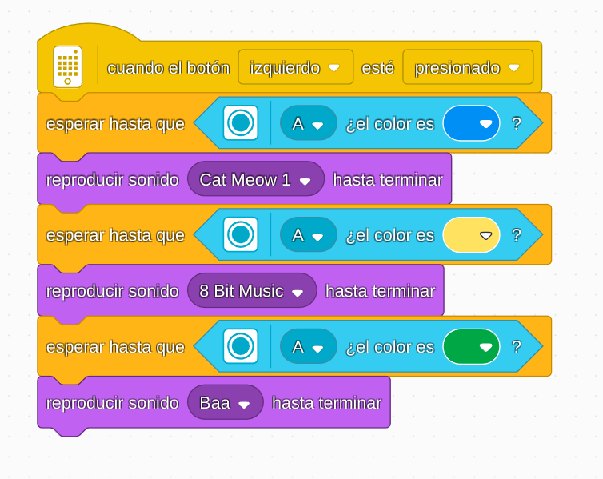

# Proyecto 1: ¡Ayuda!
## Enlace al proyecto
[Ver lección oficial en LEGO Education](https://education.lego.com/es-es/lessons/prime-invention-squad/help/)

## Instrucciones
[INSTRUCCIONES](https://assets.education.lego.com/v3/assets/blt293eea581807678a/blt7c8102105587e585/5ec96d37afa52a7b51941198/help-bi-pdf-book1of1.pdf?locale=es-es)

## Descripción general
En este proyecto, los estudiantes construirán un robot que pueda ayudar a otras personas o robots que estén en problemas. La idea es diseñar una solución simple a un problema como empujar, levantar o trasladar algo.

## Organización de los grupos
- Los grupos serán de **2 chicos**.
- **Niño A** arma la base del robot y monta el motor.
- **Niño B** arma el mecanismo que realiza la tarea de ayuda (gancho, pala, etc.).
- Luego **unen las piezas** y prueban el funcionamiento juntos.

## Actividades complementarias
- Inventar una pequeña historia donde el robot salva a otro personaje LEGO.
- Jugar a un rescate: un objeto debe ser transportado desde una zona “peligrosa” a una zona “segura” usando el robot.
- Hacer una mini competencia: ¿Qué grupo ayuda más rápido?

## Código de ejemplo

