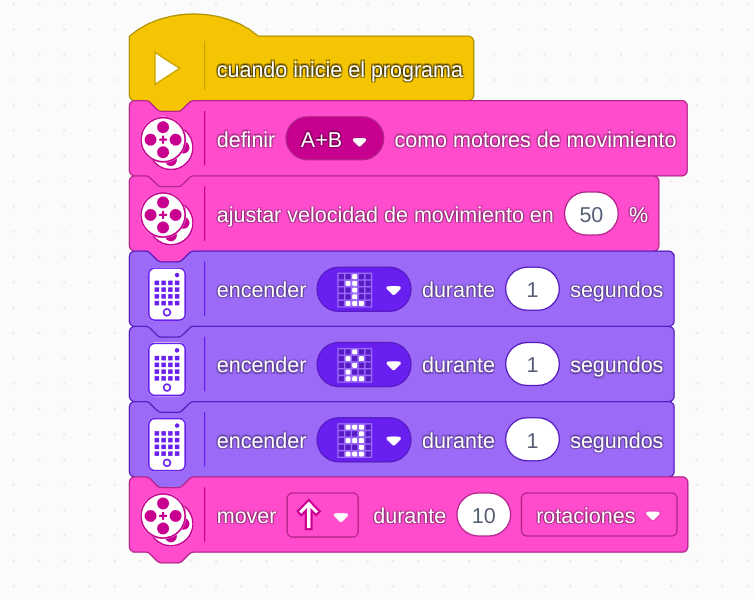

# Proyecto 2: Carrera de saltadores
## Enlace al proyecto
[Ver lección oficial en LEGO Education](https://education.lego.com/es-es/lessons/prime-invention-squad/hopper-race/)

## Instrucciones
[Instrucciones-Saltador-(22 pasos)](https://assets.education.lego.com/v3/assets/blt293eea581807678a/blt7bbfa65868142763/5ec96ddaf1de13036f79e970/hopper-bi-pdf-book1of1.pdf?locale=es-es)

## Descripción general
Construcción de un robot que salta o rebota para competir en una carrera. Se trabaja con movimientos repetitivos controlados por motores.

## Organización de los grupos
- Los grupos serán de **2 chicos**.
- **Niño A** construye la estructura del saltador.
- **Niño B** ajusta y conecta los motores.
- Juntos programan y hacen pruebas de salto.

## Actividades complementarias
- Carrera de saltadores en línea recta: ¿Cuál recorre más distancia en 30 segundos?
- Medir la distancia de salto: usar una regla o cinta métrica para comparar.
- Modificar la altura del salto y observar los cambios.

## Código de ejemplo

