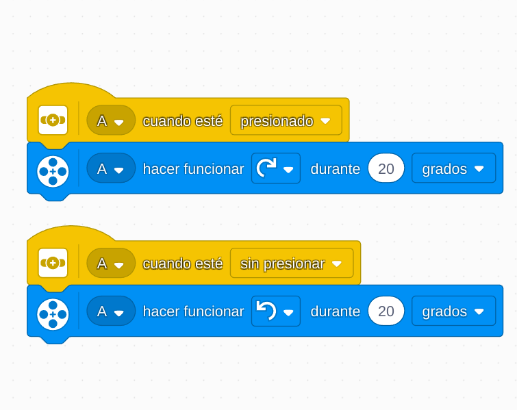

# Proyecto 3: Superlimpieza
## Enlace al proyecto
[Ver lección oficial en LEGO Education](https://education.lego.com/es-es/lessons/prime-invention-squad/super-cleanup/)

## Instrucciones
[Instrucciones_1_(15pasos)](https://assets.education.lego.com/v3/assets/blt293eea581807678a/bltdb108d96005a741c/5ec96f33e014445192ea99e2/supercleaup-bi-pdf-book3of3.pdf?locale=es-es)

[Instrucciones_2_(28pasos)](https://assets.education.lego.com/v3/assets/blt293eea581807678a/blt7f0d32ef5ad51e71/5ec96f446676f37c355f9599/supercleaup-bi-pdf-book1of3.pdf?locale=es-es)

## Descripción general
El objetivo es construir un robot que recoja o empuje objetos pequeños (como papeles o piezas LEGO) simulando una acción de limpieza.

## Organización de los grupos
- Los grupos serán de **2 chicos**.
- **Niño A** construye la base rodante.
- **Niño B** arma el cepillo o pala frontal.
- Juntos prueban el mecanismo de barrido y afinan el código.

## Actividades complementarias
- Limpiar una zona de papeles en el aula: cada grupo tiene su “área sucia”.
- Carrera de limpieza: ¿qué robot limpia más en 1 minuto?
- Inventar un nombre de empresa de limpieza con su eslogan.

## Código de ejemplo

