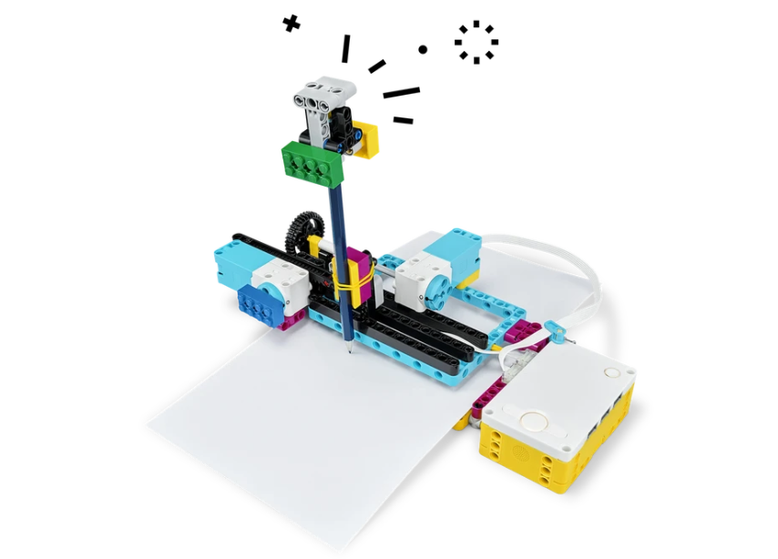
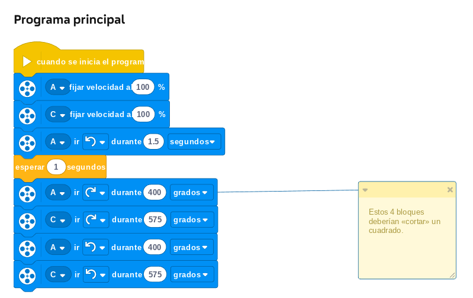
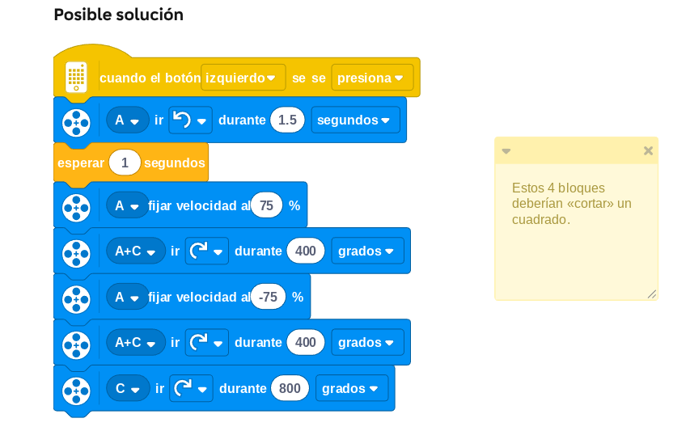

# Proyecto 4: Roto
## Enlace al proyecto
[Ver lección oficial en LEGO Education](https://education.lego.com/es-es/lessons/prime-invention-squad/broken/)

## Instrucciones
[Instrucciones 1 - (27 pasos)](https://assets.education.lego.com/v3/assets/blt293eea581807678a/bltfd7524482d88cc3a/5ec9701256542b5199dc159c/broken-bi-pdf-book1of2.pdf?locale=es-es)

[Instrucciones 2 - (35 pasos)](https://assets.education.lego.com/v3/assets/blt293eea581807678a/blt9f8ca13435605c36/5ec970a87ec01344da574ed3/broken-bi-pdf-book2of2.pdf?locale=es-es)

## Descripción general
El objetivo es diseñar un robot que pueda dibujar. No olvidar lapices

## Organización de los grupos
- Los grupos serán de **2 chicos**.
- **Niño A** construye el robot base con motores.
- **Niño B** diseña una herramienta de empuje o levante.
- Luego unen las partes y testean el conjunto.

## Actividades complementarias
- Puede usar hojas tamaño A4 en blanco para esta lección
- Cargar papel
- Ver el mejor dibujo

## Código de ejemplo

