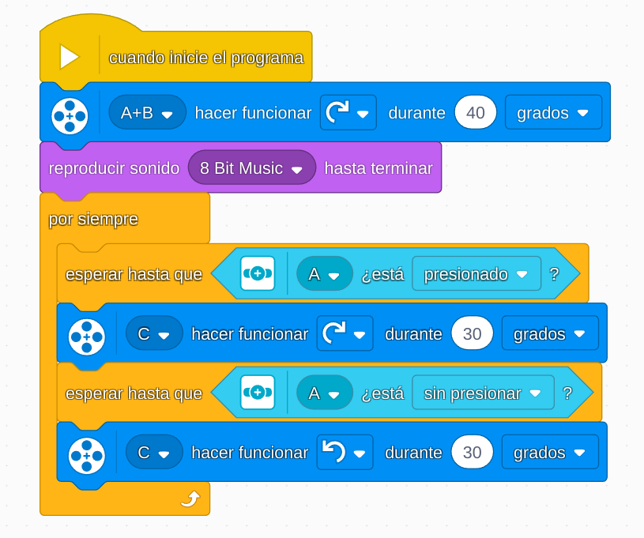

# Proyecto 5: Diseñar para alguien
## Enlace al proyecto
[Ver lección oficial en LEGO Education](https://education.lego.com/es-es/lessons/prime-invention-squad/design-for-someone/)

## Instrucciones

[INSTRUCCIONES_1_(36 pasos)](https://assets.education.lego.com/v3/assets/blt293eea581807678a/blt2e399cf8d3b5ae05/5ec9720da8bb8c02ad27b20f/design-for-someone-bi-pdf-book1of2.pdf?locale=es-es)

[INSTRUCCIONES_2_(18 pasos)](https://assets.education.lego.com/v3/assets/blt293eea581807678a/bltfa53bbbf3c618f5a/5ec97160f8b8c35280dc0696/design-for-someone-bi-pdf-book2of2.pdf?locale=es-es)

## Descripción general
Este proyecto propone construir un dispositivo que pueda asistir a una persona con alguna necesidad específica (por ejemplo, alguien con movilidad reducida o que necesite ayuda para alcanzar objetos).

## Organización de los grupos
- Los grupos serán de **2 chicos**.
- **Niño A** se encarga de construir la estructura y sistema de movimiento.
- **Niño B** diseña el mecanismo que realiza la asistencia (gancho, brazo, elevador, etc.).
- Luego unen y testean su diseño.

## Actividades complementarias
- Crear una historia sobre a quién ayuda su invento.
- Simular una situación donde el robot presta ayuda.
- Inventar un nombre para su creación como si fuera un producto comercial.

## Código de ejemplo

