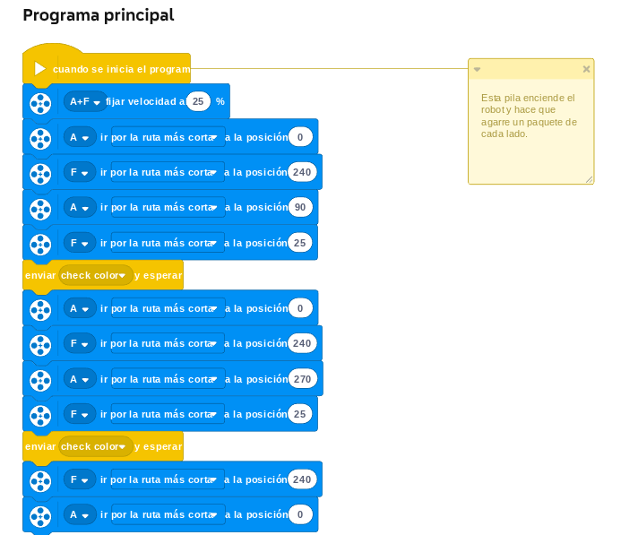
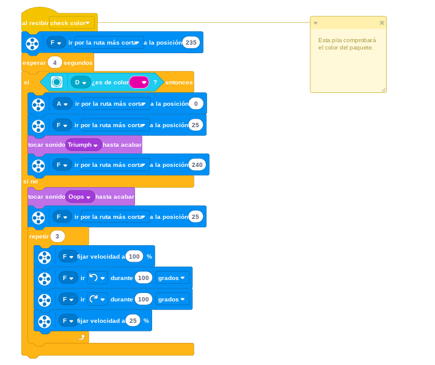

# Proyecto 6: ¡Automatízalo!
---
# OJO PROYECTO LARGO ¡¡¡NO!!! USAR EN UNA CLASE FINAL 
---
## Enlace al proyecto
[Ver lección oficial en LEGO Education](https://education.lego.com/es-es/lessons/prime-kickstart-a-business/automate-it/)

## Instrucciones

[INSTRUCCIONES_1_(18 pasos)](https://assets.education.lego.com/v3/assets/blt293eea581807678a/blt0736063849654cd1/611664001e409f13bb3b921d/automate-it-bi-pdf-book1of3.pdf?locale=es-es)

[INSTRUCCIONES_2_(58 pasos)](https://assets.education.lego.com/v3/assets/blt293eea581807678a/blt78ed611763cfb7e4/6116642d25695f14a34d7110/automate-it-bi-pdf-book2of3.pdf?locale=es-es)

[INSTRUCCIONES_3_(3 pasos)](https://assets.education.lego.com/v3/assets/blt293eea581807678a/blt75287141b30d14a8/5ec92a38598871527942751d/automate-it-bi-pdf-book3of3.pdf?locale=es-es)

## Descripción general
El objetivo es diseñar un sistema automatizado que identifique y clasifique objetos según su color, forma o tamaño, como si fuera una línea de producción.

## Organización de los grupos
- Los grupos serán de **3 chicos**.
- **Niño A** arma la cinta transportadora o base móvil.
- **Niño B** arma el sistema de detección (sensor) y empuje/clasificación.
- **Niño C** ayuda a los otros 2 a buscar piezas
- Luego ajustan juntos la programación.

## Actividades complementarias
- Hacer una fábrica de clasificación: piezas de diferentes colores que van a distintas cajas.
- Simular un proceso de empaquetado.
- Competencia: ¿Quién automatiza mejor en menor tiempo?

## Código de ejemplo

