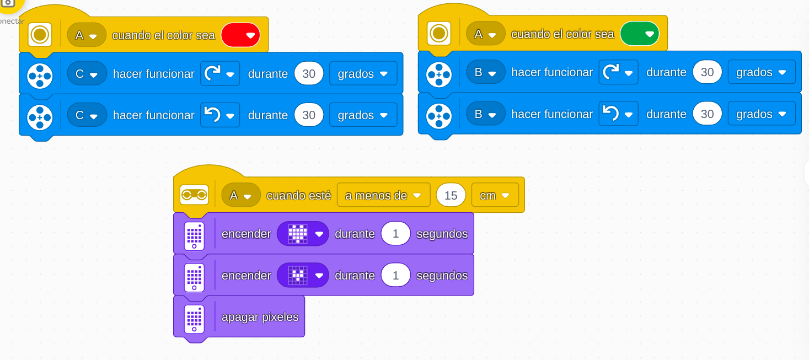

# Proyecto 7: Haz tu pedido
## Enlace al proyecto
[Ver lección oficial en LEGO Education](https://education.lego.com/es-es/lessons/prime-kickstart-a-business/place-your-order/)

## Instrucciones

[INSTRUCCIONES_1_(13 pasos)](https://assets.education.lego.com/v3/assets/blt293eea581807678a/bltac101443c1c22ca4/5ec924890482bd7de694aea7/place-your-order-bi-pdf-book1of2.pdf?locale=es-es)

[INSTRUCCIONES_2_(17 pasos)](https://assets.education.lego.com/v3/assets/blt293eea581807678a/bltcd9e881400a8b7ea/5ec924f2857d582712bdde53/place-your-order-bi-pdf-book2of2.pdf?locale=es-es)

## Descripción general
Este proyecto plantea programar un robot que diga si o no de acuerdo a colo de bloque que se le acerce al sensor de color y muestre un corazon cada vez que tenga alguien cerca del sensor de distancia

## Organización de los grupos
- Los grupos serán de **2 chicos**.
- **Niño A** arma el robot.
- **Niño B** programa las respuestas.

## Código de ejemplo
