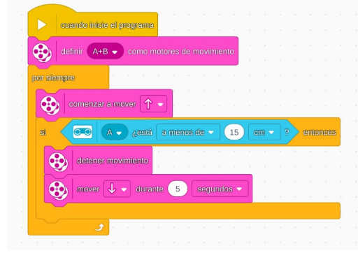

# Proyecto 8: Fuera de servicio
## Enlace al proyecto
[Ver lección oficial en LEGO Education](https://education.lego.com/es-es/lessons/prime-kickstart-a-business/out-of-order/)

## Instrucciones
[Instriciones-(39 pasos)](https://assets.education.lego.com/v3/assets/blt293eea581807678a/blt49da50c2bc43ea63/5ec9262c7976043edd42fb9f/out-of-order-bi-pdf-book1of1.pdf?locale=es-es)

## Descripción general
Diseñar un robot que reaccione cuando una máquina deja de funcionar. Puede emitir una alerta, ir a verificar, o accionar una reparación simulada.

## Organización de los grupos
- Los grupos serán de **2 chicos**.
- **Niño A** diseña el robot detector.
- **Niño B** arma el sistema de alerta (luz, sonido o mensaje).
- Luego conectan ambos sistemas.

## Actividades complementarias
- Simular un centro de mantenimiento automatizado.
- Competencia de diagnóstico: ¿Quién detecta fallas más rápido?
- Crear una historia cómica de un robot que siempre se rompe.

## Código de ejemplo

