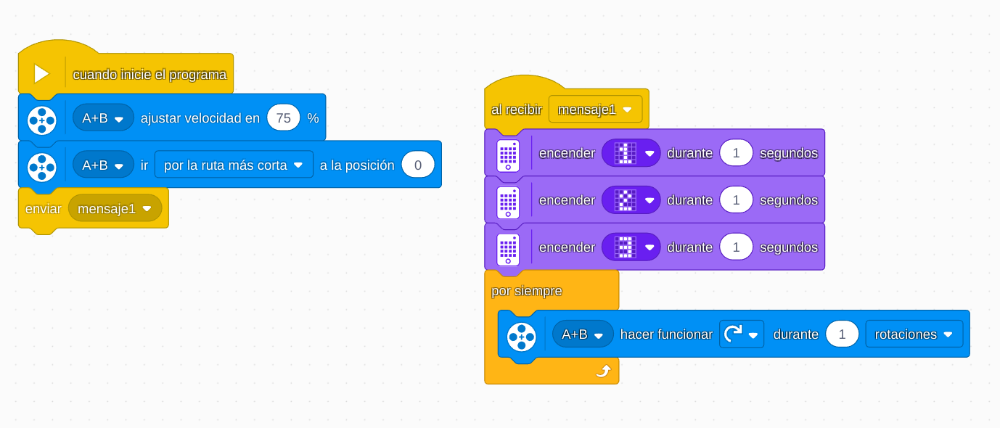

# Proyecto 9: Break Dance
## Enlace al proyecto
[Ver lección oficial en LEGO Education](https://education.lego.com/es-es/lessons/prime-life-hacks/break-dance/)

# Instrucciones

[Intrucciones-1-18(pasos)](https://assets.education.lego.com/v3/assets/blt293eea581807678a/blt1b1cabca80846180/5ec9079400455b25665b177d/break-dance-bi-pdf-book1of2.pdf?locale=es-es)

[Intrucciones-2-15(pasos)](https://assets.education.lego.com/v3/assets/blt293eea581807678a/blta15ecafc09d28bab/5ec90760f8b8c35280dbf68c/break-dance-bi-pdf-book2of2.pdf?locale=es-es)

## Descripción general
El objetivo es diseñar un robot que pueda moverse al ritmo de la música, realizando movimientos similares al break dance. Este proyecto promueve la creatividad, el uso del motor y la sincronización de movimientos con luces y sonidos.

## Organización de los grupos
- Los grupos serán de **2 chicos**.
- **Niño A** construye la estructura del robot (base móvil y estabilidad).
- **Niño B** programa la secuencia de movimientos y efectos (giro, luces, sonidos).
- Luego integran todo y ajustan los tiempos.

## Actividades complementarias
- Competencia de baile: ¿Qué robot tiene los movimientos más creativos?
- Crear una rutina con música y presentarla al grupo.
- Agregar efectos especiales: luces que cambian con el ritmo o sonidos personalizados.

## Código de ejemplo

