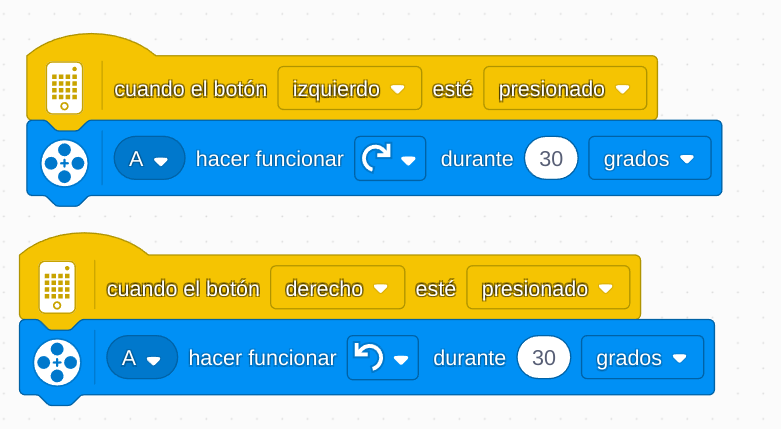

# Proyecto 10: Un sitio seguro
## Enlace al proyecto
[Ver lección oficial en LEGO Education](https://education.lego.com/es-es/lessons/prime-kickstart-a-business/keep-it-safe/)

# Instrucciones

[INSTRUCCIONES_1_(31 pasos)](https://assets.education.lego.com/v3/assets/blt293eea581807678a/blt2e399cf8d3b5ae05/5ec9720da8bb8c02ad27b20f/design-for-someone-bi-pdf-book1of2.pdf?locale=es-es)

[INSTRUCCIONES_2_(46 pasos)](https://assets.education.lego.com/v3/assets/blt293eea581807678a/blt6f9f8a049e59705a/5ec92895f32b1a633f905bf9/keep-ti-safe-bi-pdf-book2of2.pdf?locale=es-es)

## Descripción general
Diseñar un robot que ayude a proteger objetos valiosos, simulando un sistema de seguridad que detecte movimiento o intrusos.

## Organización de los grupos
- Los grupos serán de **2 chicos**.
- **Niño A** diseña el mecanismo de protección.
- **Niño B** configura sensores de movimiento o distancia.
- Luego integran alarmas o bloqueos.

## Actividades complementarias
- Juego de “protege el tesoro”: otros grupos intentan tocarlo sin activar la alarma.
- Crear escenarios con luces rojas de advertencia.
- Competencia: ¿quién tiene la seguridad más efectiva?

## Código de ejemplo

