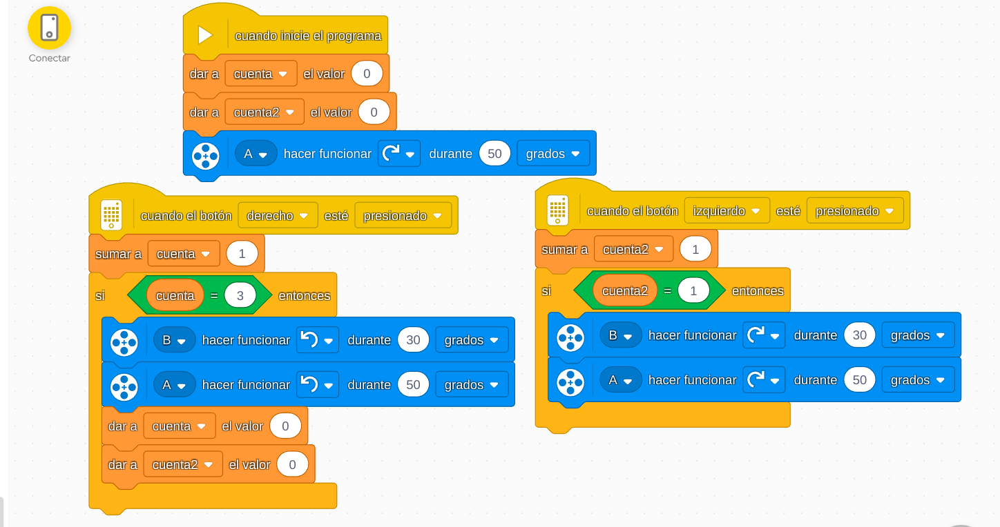

# Proyecto 11: ¡Un sitio superseguro!
## Enlace al proyecto
[Ver lección oficial en LEGO Education](https://education.lego.com/es-es/lessons/prime-kickstart-a-business/keep-it-really-safe/)

## Descripción general
Este proyecto lleva el sistema de seguridad a un nivel superior. Se puede incluir autenticación, combinaciones secretas o sensores múltiples.

## Organización de los grupos
- Los grupos serán de **2 chicos**.
- **Niño A** crea el sistema de bloqueo o cierre.
- **Niño B** agrega validaciones con sensores o entradas específicas.
- Juntos integran alertas y validaciones.

## Actividades complementarias
- Reto de acceso: ¿quién logra abrir la caja con la combinación correcta?
- Crear un código de acceso con pulsadores.
- Simular una bóveda de banco.

## Código de ejemplo

La logica del codigo es que el un boton abra la puerta apretandolo 3 veces y el otro la cierre al apretarlo

