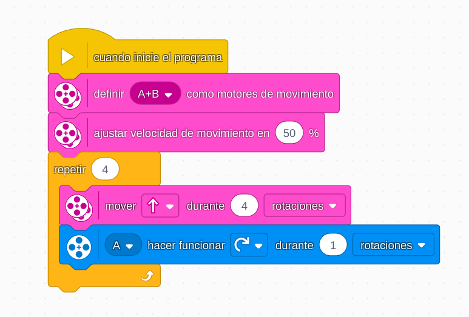

# Proyecto 12: Campamento de entrenamiento 1 - ¡A conducir!
## Enlace al proyecto
[Ver lección oficial en LEGO Education](https://education.lego.com/es-mx/lessons/prime-competition-ready/training-camp-1-driving-around/)

# Instrucciones

[INTRUCCIONES - 34 pasos](https://assets.education.lego.com/v3/assets/blt293eea581807678a/blt06873e1b438a0d7e/5ec8e66f033ad5045f4c79a6/driving-base-bi-pdf-book1of1.pdf?locale=es-mx)

## Descripción general
Los alumnos entrenan habilidades básicas de conducción de robots, incluyendo movimientos precisos, giros y alineación con pistas o marcas.

## Organización de los grupos
- Los grupos serán de **2 chicos**.
- **Niño A** programa movimientos básicos y giros.
- **Niño B** arma y ajusta la estructura para maniobras.
- Luego realizan pruebas de precisión juntos.

## Actividades complementarias
- Pista de obstáculos.
- Carrera de precisión: deben completar un recorrido sin salirse del camino.
- Medir distancia recorrida y error de giro.

## Código de ejemplo

La logica seria que ponga obstaculos en el suelo y los vayan pasando modificando el codigo, pero como primer ejercicio que hagan que el robot se mueva representando un cuadrado

