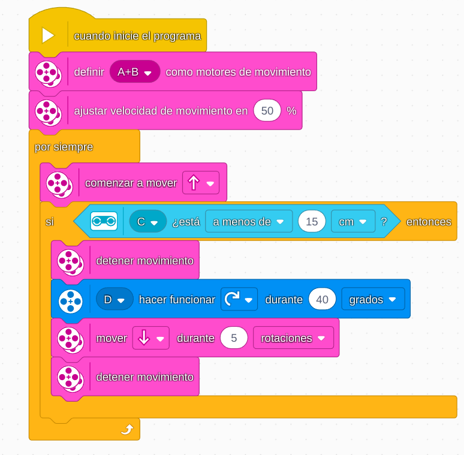

# Proyecto 13: Campamento de entrenamiento 2 - Jugar con objetos
## Enlace al proyecto
[Ver lección oficial en LEGO Education](https://education.lego.com/es-es/lessons/prime-competition-ready/training-camp-2-playing-with-objects/)

# Instrucciones
[INTRUCCIONES - 34 pasos](https://assets.education.lego.com/v3/assets/blt293eea581807678a/blt06873e1b438a0d7e/5ec8e66f033ad5045f4c79a6/driving-base-bi-pdf-book1of1.pdf?locale=es-mx)

[Instrucciones 2 - 40 pasos](https://assets.education.lego.com/v3/assets/blt293eea581807678a/blt4e022269eb67e4d6/5ec8e6ef694dd13eb3ffac29/driving-base-tools-accessories-bi-pdf-book1of1.pdf?locale=es-es)

## Descripción general
El proyecto se centra en diseñar un robot capaz de manipular objetos mediante pinzas, empujadores u otros mecanismos, ideal para desafíos de competencia.

## Organización de los grupos
- Los grupos serán de **2 chicos**.
- **Niño A** construye la base y el sistema de tracción.
- **Niño B** diseña y monta el mecanismo de agarre o empuje.
- Luego integran y ajustan el código juntos.

## Actividades complementarias
- Juego de “llevar la caja”: mover objetos de un punto A a B.
- Competencia de manipulación: ¿quién puede mover más objetos?
- Usar bloques o piezas específicas como “elementos frágiles”.

## Código de ejemplo

