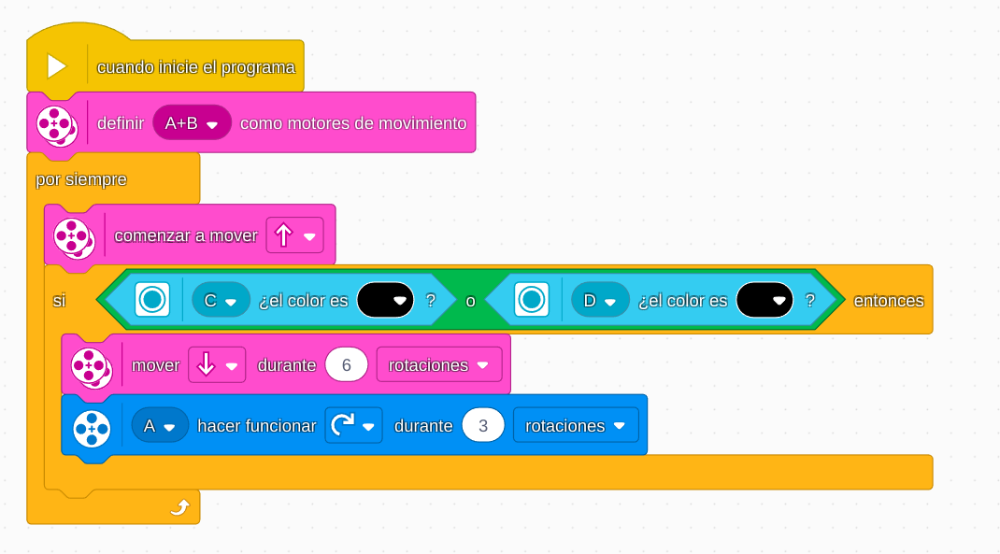

# Proyecto 14: Mi código, nuestro programa
## Enlace al proyecto
[Ver lección oficial en LEGO Education](https://education.lego.com/es-es/lessons/prime-competition-ready/my-code-our-program/)

# Instrucciones

[Instrucciones 1 - 38 pasos](https://assets.education.lego.com/v3/assets/blt293eea581807678a/blt2d17fa746ea991e5/5ec8e83df11f7e3ed6d502d7/advanced-driving-base-bi-pdf-book1of5.pdf?locale=es-es)
[Instrucciones 2 - 24 pasos](https://assets.education.lego.com/v3/assets/blt293eea581807678a/bltaab3ff32deffc66d/5ec8e800f32b1a633f9052dd/advanced-driving-base-bi-pdf-book2of5.pdf?locale=es-es)
[Instrucciones 3 - 24 pasos](https://assets.education.lego.com/v3/assets/blt293eea581807678a/blt43751cee8daa89a7/5ec8e7f4f32b1a633f9052d7/advanced-driving-base-bi-pdf-book3of5.pdf?locale=es-es)
[Instrucciones 4 - 32 pasos](https://assets.education.lego.com/v3/assets/blt293eea581807678a/bltbaec24f63e4075fc/5ec8e806f555a00375660930/advanced-driving-base-bi-pdf-book4of5.pdf?locale=es-es)
[Instrucciones 5 - 19 pasos](https://assets.education.lego.com/v3/assets/blt293eea581807678a/bltdfc58a87376f5440/5ec8e868afa52a7b5193fda0/advanced-driving-base-bi-pdf-book5of5.pdf?locale=es-es)
[Instrucciones 6 - 3 pasos](https://assets.education.lego.com/v3/assets/blt293eea581807678a/blt3e300a0f13a1ede9/5ec8e8af00455b25665b12da/markers-bi-pdf-book1of1.pdf?locale=es-es)

## Descripción general
Los estudiantes aprenderán a dividir su programa en bloques personalizados reutilizables, fomentando una programación más limpia y colaborativa.

## Organización de los grupos
- Los grupos serán de **5 chicos**.
- Cada chico tendra un set de instrucciones especifico que realizar (Usar 2 computadoras por grupo, pantalla dividida)  
- Cada uno crea un bloque funcional (por ejemplo: avanzar, girar, detectar).
- Luego integran todos los bloques en un único programa colaborativo.

## Actividades complementarias
- Programar una rutina de movimientos.
- Juego de “código sorpresa”: usar bloques de otro grupo sin verlos antes.

## Código de ejemplo

