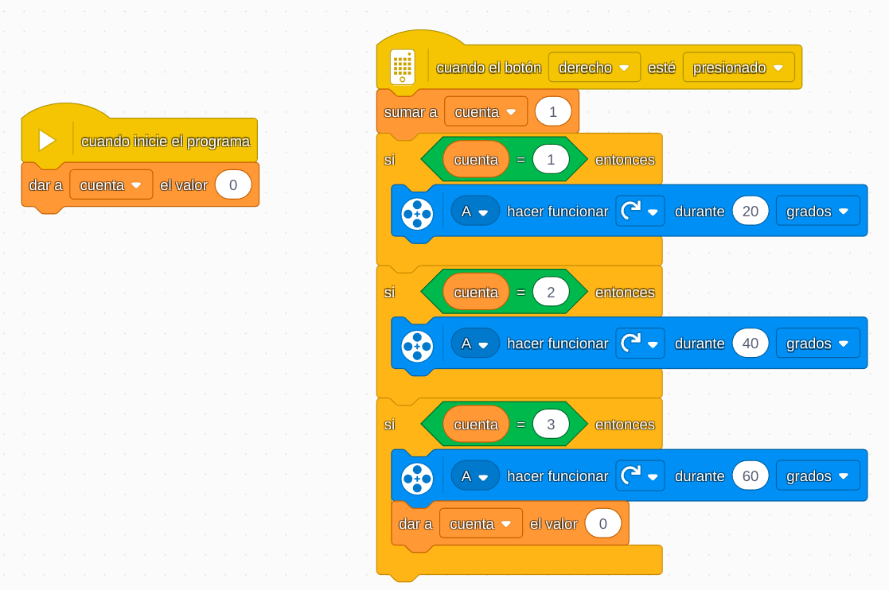

# Proyecto 15: Velocidad del viento
## Enlace al proyecto
[Ver lección oficial en LEGO Education](https://education.lego.com/es-es/lessons/prime-life-hacks/wind-speed/)

## Descripción general
Este proyecto propone construir un anemómetro (medidor de velocidad del viento) utilizando motores y sensores de rotación. El objetivo es que el robot registre la velocidad del viento simulada mediante un ventilador o corriente de aire.

## Organización de los grupos
- Los grupos serán de **2 chicos**.
- **Niño A** construye la estructura con aspas que giran con el viento.
- **Niño B** configura el sensor de rotación y programa la lectura de datos.
- Luego integran todo para medir y mostrar la velocidad en pantalla o luces.

## Actividades complementarias
- Simular viento con un ventilador y comparar mediciones.
- Graficar la velocidad del viento en distintos puntos del aula.
- Competencia: ¿quién construye el medidor más preciso?

## Código de ejemplo
El presionar el boton simula que aumenta el viento

