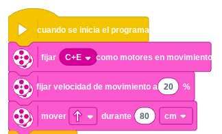

# Proyecto 16: Cuesta arriba
## Enlace al proyecto
[Ver lección oficial en LEGO Education](https://education.lego.com/es-es/lessons/prime-training-trackers/this-is-uphill/)

# Instrucciones

[Instrucciones 1 - 40 pasos](https://assets.education.lego.com/v3/assets/blt293eea581807678a/bltfca70d091e5c8caa/5f3103a848bdc47f3f1e6a83/45678_biker_book1.pdf?locale=es-es)
[Instrucciones 2 - 31 pasos](https://assets.education.lego.com/v3/assets/blt293eea581807678a/blte4f14703699d8b0a/5f3103a548bdc47f3f1e6a7f/45678_biker_book2.pdf?locale=es-es)

## Descripción general
Construcción de un robot capaz de subir pendientes. El desafío consiste en ajustar potencia y estructura para superar la inclinación.

## Organización de los grupos
- Los grupos serán de **2 chicos**.
- **Niño A** construye la estructura reforzada.
- **Niño B** programa el control de velocidad y sensores si los usa.
- Luego ajustan peso, balance y pruebas en subida.

## Actividades complementarias
- Competencia de quién sube más alto.
- Pruebas en distintas pendientes (más o menos inclinadas).
- Analizar el ángulo máximo que logra subir cada robot.

## Código de ejemplo

