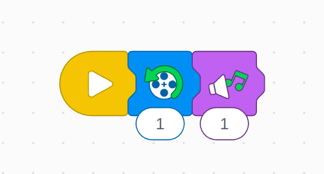

# Proyecto: Excursión en barco
## Enlace al proyecto
[Ver lección oficial en LEGO Education](https://education.lego.com/es-es/lessons/spikeessential-great-adventures/spikeessential-boat-trip/)

# Instrucciones
[Instrucciones 1 - 22 pasos](https://assets.education.lego.com/v3/assets/blt293eea581807678a/bltf0bac8739bf2d2ae/5f572f02aa9c5d49b5c93176/U1L1.pdf?locale=es-es)

## Descripción general
Empujar un barco con un motor
(Inventar una Historia)

## Organización de los grupos
- Grupos de **2 chicos**.
- Repartir la construcción y programación para colaborar.
- Cada uno arma una parte del proyecto y luego integran.

## Actividades complementarias
- Juegos relacionados al tema del proyecto.
- Decoración creativa del robot.
- Presentación final de lo aprendido y construido.

## Código de ejemplo

Elegir una musica para que el barco salga del puerto

