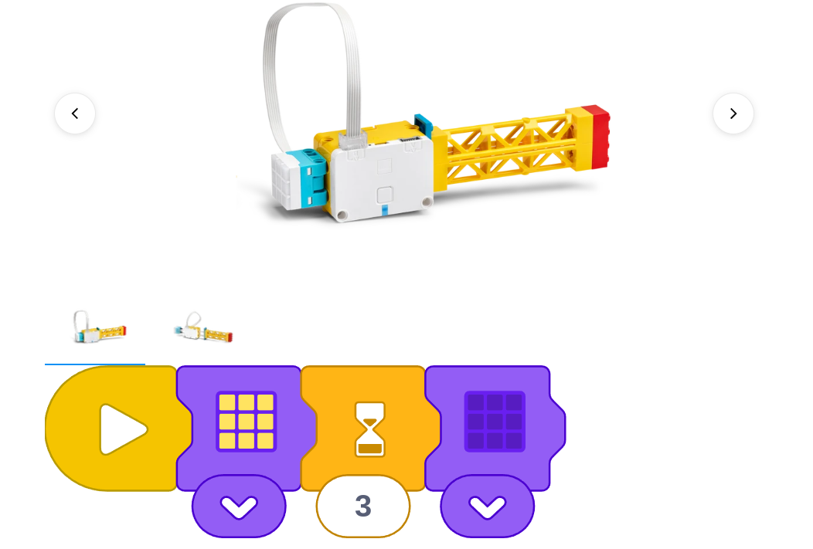

# Proyecto: Iluminación
## Enlace al proyecto
[Ver lección oficial en LEGO Education](https://education.lego.com/es-es/lessons/spike-essential-science-see-it-hear-it-build-it/spikeessential-illumination/)

## Descripción general
En esta lección, el aprendizaje fundamental consiste en observar el efecto de la luz en un espacio oscuro para descubrir que los objetos solo pueden verse en su presencia. Los alumnos construirán un modelo de una linterna como forma práctica y divertida de hacer las observaciones. Se ofrecen ejemplos como inspiración. Anima a los alumnos a construir el modelo de una linterna que se les ocurra.  
Si decides usar una habitación a oscuras, considera prestar atención a cualquier alumno que pueda sentirse incómodo en ella.

- **Fundamentos científicos. Iluminación:** El punto principal de esta lección es que los humanos necesitan luz para ver los objetos.
  - Objetos como el sol, el fuego, las luciérnagas, las bombillas y las pantallas electrónicas pueden verse porque son fuentes de luz, y esta viaja directamente hasta el ojo.
  - Otros, como la luna, los planetas, la mayoría de las rocas y los árboles, no son fuentes de luz, y solo pueden verse cuando la luz procedente de una fuente de luz rebota sobre ellos (se refleja) y llega hasta el ojo.
  - Cuando el ojo detecta la luz, se envían unas señales eléctricas al cerebro para que se interpreten como imágenes.

- **Conocimientos previos. Iluminación:** Usando los materiales de ciencias disponibles y los fundamentos proporcionados, comparte información, imágenes y definiciones.
  - Los seres humanos necesitan luz para ver.
  - Los objetos que emiten luz se llaman “fuentes de luz”. El sol, otras estrellas, los relámpagos, las hogueras, las velas, las lámparas y las linternas son ejemplos de fuentes de luz.
  - Los objetos que no generan luz solo pueden verse si la luz incide sobre ellos. La luna, una pelota de baloncesto y un ratón son ejemplos de objetos que no generan su propia luz.

- **Vocabulario fundamental:** fuente de luz

- Presenta a los personajes principales de la historia y el primer desafío: Sofie piensa que hay algo bajo su cama. ¿Puedes ayudarla a verlo?

- **PIENSA:** Mantened una breve charla sobre los temas de la lección y las pruebas realizando una pequeña investigación práctica y usando, si quieres, la imagen de la historia.

  - Oscurece la sala. Después, deja que entre la luz en la sala. A continuación, oscurece de nuevo la sala y usa una linterna para iluminar una esquina. (Prepara a los alumnos. Excusa o ayuda a quienes no se sientan cómodos en la oscuridad).

  - **¿Qué pudisteis ver en la sala a oscuras? ¿Por qué?**  
    (No mucho, porque no hay una buena fuente de luz).

  - **¿Qué podéis ver cuando la sala está iluminada? ¿Por qué? ¿Cuáles son las fuentes de luz?**  
    (Todo lo que hay en la sala, ya que las fuentes de luz iluminan los objetos; la luz eléctrica desde dentro, quizá la luz del sol desde fuera).

  - **¿Qué pudisteis ver en la sala a oscuras con una linterna apuntando hacia una esquina? ¿Gracias a qué pudisteis ver?**  
    (Los objetos de la esquina, pero el resto de la sala estaba más oscura; gracias a la linterna, porque iluminaba la esquina).

  - **¿Qué necesita Sofie para ver el objeto que hay debajo de la cama?**  
    (Necesita una fuente de luz bajo la cama. Una linterna serviría).

- Reparte un Set SPIKE™ Essential de LEGO® Education y un dispositivo a cada grupo.

## Organización de los grupos
- Grupos de **2 chicos**.
- Repartir la construcción y programación para colaborar.
- Cada uno arma una parte del proyecto y luego integran.

## Actividades complementarias
- Juegos relacionados al tema del proyecto.
- Decoración creativa del robot.
- Presentación final de lo aprendido y construido.

## Código de ejemplo

