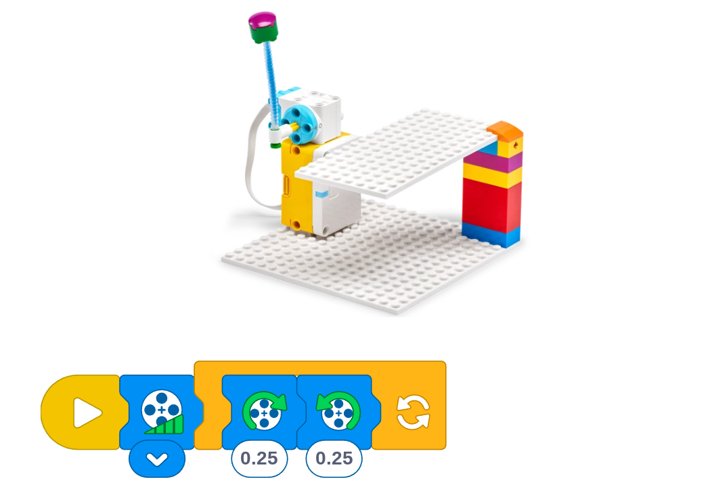

# Proyecto: Vibración musical
## Enlace al proyecto
[Ver lección oficial en LEGO Education](https://education.lego.com/es-es/lessons/spike-essential-science-see-it-hear-it-build-it/spikeessential-Musical-vibration/)

## Descripción general
En esta lección, el aprendizaje fundamental consiste en planificar e investigar el modo en que la vibración produce sonidos. Diseñar y construir un modelo es una forma divertida y práctica de investigar. Se ofrecen ejemplos como inspiración. El alumnado debe construir sus ideas de un tambor u otro modelo de prueba.

- **Fundamentos científicos. Vibración musical:**
  - Cuando un objeto vibra, crea una onda de energía (llamada “onda sonora”) que viaja por el aire. La onda hace vibrar los tímpanos y el cerebro reconoce eso como un sonido.
  - Los instrumentos musicales se pueden clasificar según la forma en que producen ondas sonoras. En el caso de los instrumentos de percusión (como el tambor o el xilófono), el instrumento entero vibra cuando lo tocamos.
  - Los instrumentos de cuerda (como el violín o la guitarra) producen ondas sonoras a partir de las cuerdas que vibran.
  - Los instrumentos de viento (como la trompeta, la flauta dulce o la flauta travesera) producen sonido haciendo vibrar la columna de aire que hay dentro del instrumento.
  - Las vibraciones de los instrumentos musicales pueden apreciarse por el tacto, a veces por la vista, y también por el sonido.
  - **NOTA:** Si los alumnos no pueden sentir ni observar ninguna vibración con la placa LEGO blanca, sugiéreles que usen el vaso de papel, donde les resultará más fácil observarla.

- **Conocimientos previos. Vibración musical:** Usando los materiales de ciencias disponibles, comparte información, imágenes y definiciones.
  - Entre los instrumentos musicales más comunes tenemos el tambor, el triángulo, el diapasón, el xilófono, la guitarra, el piano, la flauta, etc.
  - Cuando un objeto vibra, se mueve o agita hacia delante y hacia atrás.
  - Los materiales que vibran producen ondas sonoras.
  - Las ondas sonoras pueden detectarse cuando los materiales vibran.

- **Vocabulario fundamental:** vibrar, vibración, fuente sonora

## Organización de los grupos
- Grupos de **2 chicos**.
- Repartir la construcción y programación para colaborar.
- Cada uno arma una parte del proyecto y luego integran.

## Actividades complementarias
- Juegos relacionados al tema del proyecto.
- Decoración creativa del robot.
- Presentación final de lo aprendido y construido.

## Código de ejemplo

