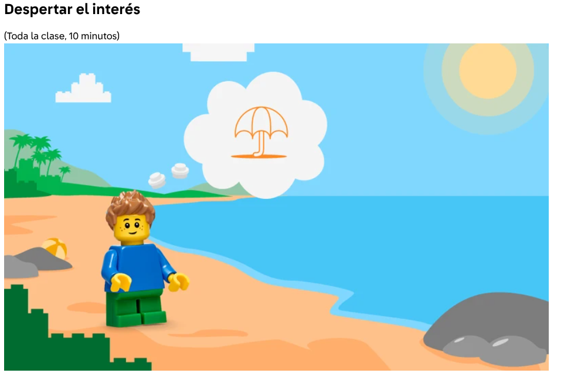
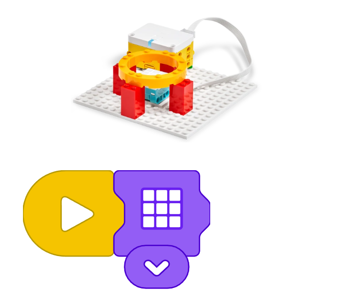

# Proyecto: Transparencia
## Enlace al proyecto
[Ver lección oficial en LEGO Education](https://education.lego.com/es-es/lessons/spike-essential-science-see-it-hear-it-build-it/spikeessential-transparency/)

## Descripción general
- **Fundamentos científicos. Luz:**
  - La luz se desplaza en líneas rectas a las que denominamos “haces de luz”.
  - A los materiales que permiten pasar a través de ellos la mayor parte de la luz de un haz (como el plástico o el vidrio sin colorear) los llamamos *transparentes*.
  - A los materiales que permiten pasar a través de ellos algo de luz (como una servilleta de papel) los llamamos *translúcidos*.
  - A los materiales que no permiten pasar a través de ellos nada de luz (como un taco de madera) los llamamos *opacos*.
  - Si quieres, puedes hacer una demostración con unos cuantos objetos del aula durante la sección “Despertar el interés”.

- **Conocimientos previos. Luz:** Usando los materiales de ciencias disponibles, comparte información, imágenes y definiciones.
  - Los seres humanos necesitan luz para ver.
  - Algunos objetos (el sol, los relámpagos, las bombillas) generan su propia luz, mientras que otros no (sillas, árboles, mesas de madera).
  - Los objetos están hechos de muchas clases de materiales. Cada material afecta a un haz de luz de manera diferente.

- **Vocabulario fundamental:** fuente de luz, haz de luz, material

- Presenta a los personajes principales de la historia y el primer desafío: Hoy hace mucho sol, y Leo quiere crear algo que haga sombra. ¿Qué materiales debería usar? Ayúdale a descubrirlo.

- **PIENSA:** Mantened una breve charla sobre los temas de la lección usando, si quieres, objetos del aula y la imagen de la historia.

  - Señala algunos objetos del aula y pregunta: **¿De qué material está hecho esto?** (Plástico, vidrio, algodón, metal, madera).

  - **¿Qué le pasa a un haz de luz cuando incide sobre estos materiales distintos? ¿Pasa a través?**  
    (A veces, el haz pasa a través del objeto, como en el caso del plástico o el vidrio, e ilumina algo que está detrás de él.  
    A veces solo pasa algo de luz, como en el caso de la tela o el papel higiénico, por lo que no puedes ver con claridad tras el objeto.  
    Otras veces no pasa nada de luz a través, como en el caso del metal o la madera, y en su lugar se crea una sombra al otro lado del objeto).

  - **¿Cómo podéis ayudar a Leo a encontrar un material que haga buena sombra? ¿Cuáles son algunas maneras posibles de probar los materiales?**  
    *Charla con tu compañero más cercano y compartid ideas.*  
    (Podemos dirigir un haz de luz hacia diferentes materiales y ver cuál proporciona la cantidad de sombra que queremos.  
    Anima a sugerir ideas para las pruebas, que deberían incluir un examen de los objetos del aula, la predicción del nivel de transparencia/opacidad y el uso de una fuente de luz para comprobar su predicción).

  - Señala los objetos recopilados y di: **Elegid algunos objetos de materiales distintos. ¿Qué creéis que pasará con la luz?**  
    Usemos las etiquetas **“toda la luz”**, **“algo de luz”** o **“nada de luz”**.  
    (Revisa dónde están los objetos y cómo accederán a ellos los alumnos).

## Organización de los grupos
- Grupos de **2 chicos**.
- Repartir la construcción y programación para colaborar.
- Cada uno arma una parte del proyecto y luego integran.

## Actividades complementarias
- Juegos relacionados al tema del proyecto.
- Decoración creativa del robot.
- Presentación final de lo aprendido y construido.

## Código de ejemplo

