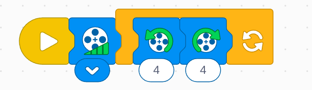

# Proyecto: El gol decisivo
## Enlace al proyecto
[Ver lección oficial en LEGO Education](https://education.lego.com/es-es/lessons/spikeessential-quirky-creations/spikeessential-winning-goal/)

## Instrucciones
[instrucciones](https://assets.education.lego.com/v3/assets/blt293eea581807678a/bltd118b3deb9d24732/5f573141aa9c5d49b5c93184/U5L5.pdf?locale=es-es)

## Descripción general
(Completar con una breve descripción adaptada para niños de 5 a 8 años basada en el recurso oficial.)

## Organización de los grupos
- Grupos de **2 chicos**.
- Repartir la construcción y programación para colaborar.
- Cada uno arma una parte del proyecto y luego integran.

## Actividades complementarias
- Juegos relacionados al tema del proyecto.
- Decoración creativa del robot.
- Presentación final de lo aprendido y construido.

## Código de ejemplo

