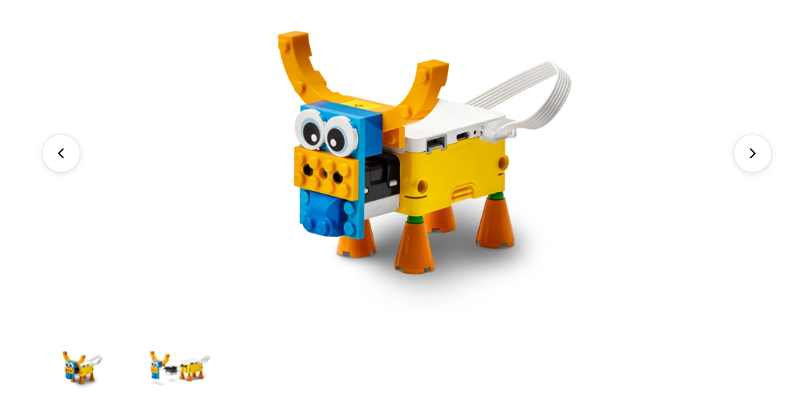

# Proyecto: Comportamiento animal
## Enlace al proyecto
[Ver lección oficial en LEGO Education](https://education.lego.com/es-es/lessons/spike-essential-animals-and-their-environments/spike-essential-animal-behavior/)

## Descripción general
(Completar con una breve descripción adaptada para niños de 5 a 8 años basada en el recurso oficial.)

## Organización de los grupos
- Grupos de **2 chicos**.
- Repartir la construcción y programación para colaborar.
- Cada uno arma una parte del proyecto y luego integran.

## Actividades complementarias
- Juegos relacionados al tema del proyecto.
- Decoración creativa del robot.
- Presentación final de lo aprendido y construido.

## Código de ejemplo

Agregar mas sonidos deacuerdo a colores

